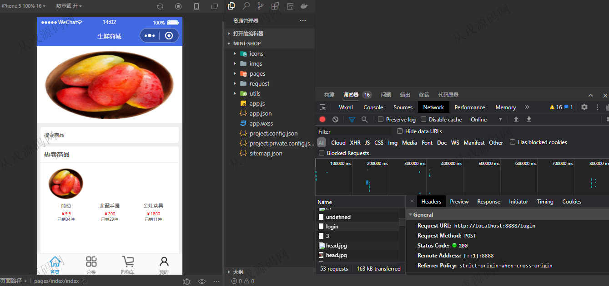
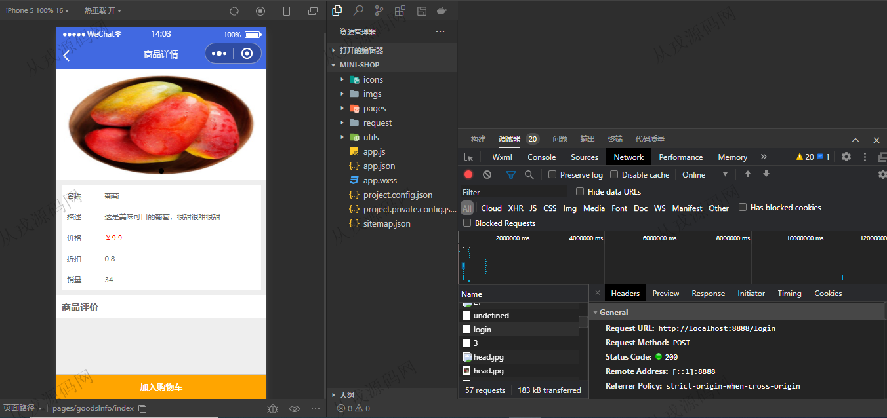
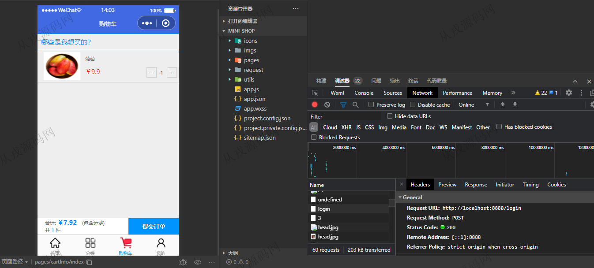
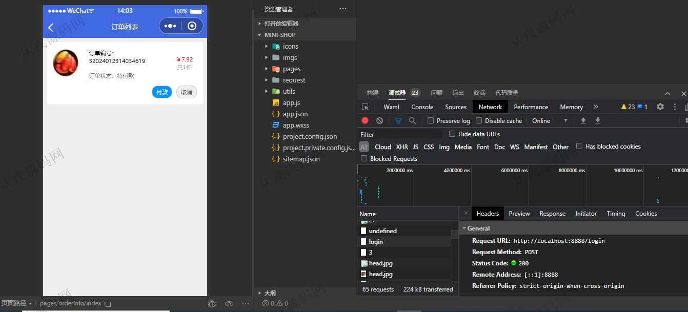
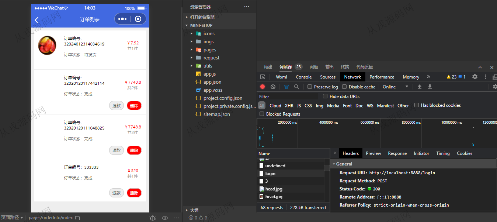
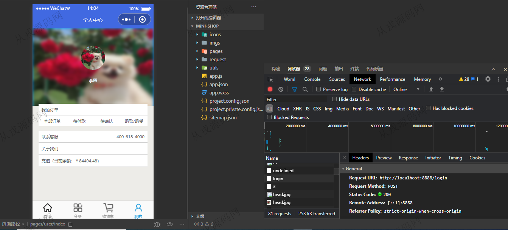
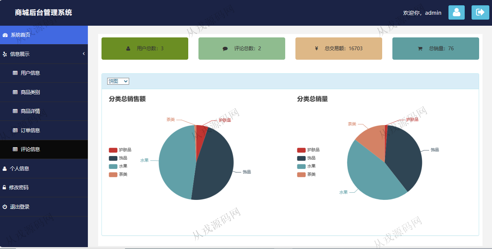
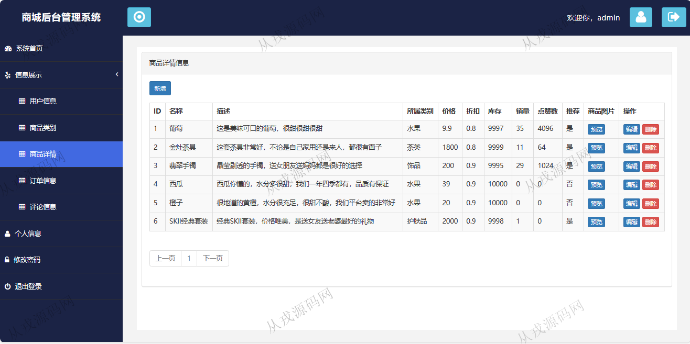
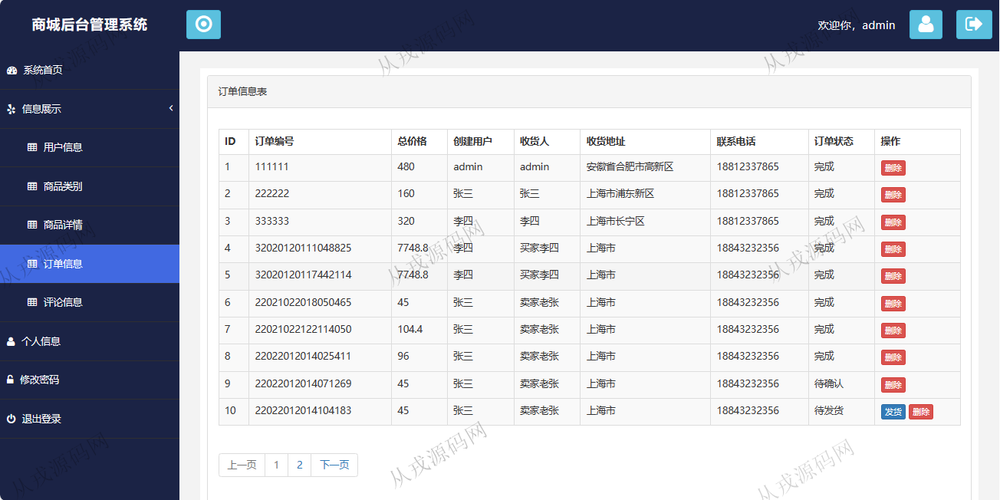

<h1 align="center">213.生鲜商城管理系统-小程序</h1>

 获取sql文件 QQ: 386869957 QQ群: 377586148 

 [更多源码项目: 从戎源码网](https://armycodes.com/) 

## 简介

> 本代码来源于网络,仅供学习参考使用!
>
> 提供1.远程部署/2.修改代码/3.设计文档指导/4.框架代码讲解等服务
>
> 管理后台访问地址：http://localhost:8888/end/page/login.html
> 
> 管理员：admin 123456
> 
> 用户：李四 123456
>

## 项目介绍
基于小程序+springboot的生鲜商城管理系统：前端 html、jquery、小程序，后端 maven、springmvc、spring、mybatis；角色分为管理员、用户；集成商品浏览、购物车、在线结算、商品后台维护等功能于一体的系统。

## 功能介绍

### 小程序

- 首页：轮播图，搜索商品，热卖商品，推荐商品
- 分类：分类展示，分类导航
- 购买：商品详情，商品加入购物车，购物车列表，在线结算
- 我的：我的订单列表查询，订单信息详情，订单退款，订单删除，余额充值

### 管理后台

- 用户信息：用户信息的增删改查
- 商品类别：类别信息的增删改查
- 商品详情：商品详情的增删改查，商品图片上传，图片预览
- 订单信息：查询用户下单的订单列表数据，订单状态查看，订单发货，订单删除
- 评论信息：查询用户的评论信息，评论删除
- 系统首页：用户数、评论数、总交易额、总销量统计数据展示，饼图展示分类销售额数据
- 个人信息：个人信息查看与修改，密码修改

## 环境

- <b>IntelliJ IDEA 2021.3</b>

- <b>Mysql 5.7.26</b>

- <b>JDK 1.8</b>

- <b>微信开发者工具 </b>

## 运行截图

